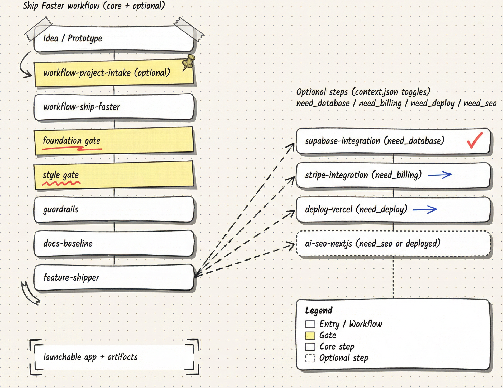

<div align="center">


<br />

**16 composable skills + 7 runnable templates for AI coding agents**

*Idea → Code → Deploy in one workflow. Resumable runs. Approval gates. Full audit trail.*

<br />

[](./skills/)
[](./templates/)
[](LICENSE)

<br />

[📚 Docs](./docs/) · [🛠️ Skills](./skills/) · [📦 Templates](./templates/) · [⚡ Quick Start](#-quick-start)

<br />

English | [简体中文](./README.zh-CN.md)

</div>

---

## 🤔 Why Ship Faster?

| Without | With Ship Faster |
|---------|------------------|
| 😩 Agent loses context mid-task | ✅ Every run writes to disk — **resumable anytime** |
| 🔥 No audit trail | ✅ Full logs + evidence for **replay/review** |
| 💣 Risky deploys, DB writes, payments | ✅ **Approval gates** before side effects |
| 🎲 Ad-hoc prompts, inconsistent outputs | ✅ **Composable skills** with predictable structure |

---

## 🎯 Who is this for?

- 🤖 **AI coding agents** (Claude Code, Cursor, OpenCode, etc.) — skills are the primary interface
- 👨‍💻 **Developers** who operate those agents — copy/paste prompts, review artifacts, approve gates
- 👥 **Teams** who want reproducible, auditable AI-assisted development

> 💡 This is NOT a CLI, NOT a SaaS. It's a set of **files you copy** into your agent's skill directory.

---

## 🔗 Works With

<p align="center">


</p>

**Default Stack:**

<p align="center">


</p>

---

## ⚡ Quick Start

### Option A: Install skills only (10 seconds)

```bash
# macOS / Linux
mkdir -p ~/.claude/skills
curl -L https://github.com/Heyvhuang/ship-faster/archive/refs/heads/main.tar.gz \
  | tar -xz --strip-components=2 -C ~/.claude/skills ship-faster-main/skills/
```

<details>
<summary>🪟 Windows (PowerShell)</summary>

```powershell
New-Item -ItemType Directory -Force -Path "$HOME\.claude\skills" | Out-Null
$zip = "$env:TEMP\ship-faster-main.zip"
Invoke-WebRequest -Uri "https://github.com/Heyvhuang/ship-faster/archive/refs/heads/main.zip" -OutFile $zip
Expand-Archive -Path $zip -DestinationPath "$env:TEMP\ship-faster" -Force
Copy-Item -Recurse -Force "$env:TEMP\ship-faster\ship-faster-main\skills\*" "$HOME\.claude\skills\"
```

</details>

### Option B: Clone for templates + skills (30 seconds)

```bash
git clone https://github.com/Heyvhuang/ship-faster.git
cd ship-faster

# Copy skills to your agent
cp -r skills/* ~/.claude/skills/

# Or run a template directly
cd templates/001-copyback-studio && pnpm install && pnpm dev
```

---

## 🚀 Pick Your Path

Once skills are installed, paste one of these into your agent:

| Scenario | Prompt |
|----------|--------|
| 💡 **I have an idea** | `Use workflow-project-intake` |
| 📦 **I have a repo** | `Use workflow-ship-faster` |
| 🎯 **I want one feature** | `Use workflow-feature-shipper` |
| 🎨 **I need UI/UX direction** | `Use tool-design-style-selector` |

<details>
<summary>📋 Full prompt examples</summary>

**💡 Start from scratch:**
```text
Use workflow-project-intake.

Idea: <what are we building?>
Users: <who is it for?>
Must-have: <3-5 bullets>
Constraints: <deadline / tech / design / infra>
Need: deploy? database? billing? seo?
```

**📦 Ship existing repo:**
```text
Use workflow-ship-faster.

Repo path: <absolute path or '.'>
Constraints: <deadline / tech / non-goals>
Need: deploy? database? billing? seo?
```

**🎯 One feature (PR-sized):**
```text
Use workflow-feature-shipper.

Repo path: <absolute path or '.'>
Feature: <one sentence>
Acceptance criteria:
- <bullet>
- <bullet>
Non-goals:
- <bullet>
```

</details>

---

## 🔄 How It Works

<p align="center">

</p>

Every run writes to disk for **replay/audit/resume**:

```
runs/ship-faster/active/<run_id>/
├── proposal.md      # Why/what/scope (stable context)
├── tasks.md         # Checklist [ ] → [x] (resume here!)
├── context.json     # Switches (deploy/db/billing/seo)
├── evidence/        # Large outputs / audits
└── logs/            # Debug events
```

> 📖 Learn more: [Runs & Approvals](docs/concepts/runs-and-approvals.md)

---

## 🛠️ Skills (16+)

Composable workflows that ship end-to-end. Copy to `~/.claude/skills/`.

### 🔄 Workflows
- ⚡ [workflow-ship-faster](skills/workflow-ship-faster/) — End-to-end: idea → foundation → design → deploy
- 📥 [workflow-project-intake](skills/workflow-project-intake/) — Brainstorm → clarify → route to workflow
- 🚀 [workflow-feature-shipper](skills/workflow-feature-shipper/) — PR-sized feature iteration
- 🧠 [workflow-brainstorm](skills/workflow-brainstorm/) — One question at a time → design spec

### 🔧 Tools
- 🎨 [tool-design-style-selector](skills/tool-design-style-selector/) — Scan project → generate design-system.md
- 🖌️ [tool-ui-ux-pro-max](skills/tool-ui-ux-pro-max/) — Palette / typography / UX lookup database
- 🔍 [tool-ast-grep-rules](skills/tool-ast-grep-rules/) — AST-based code search & rewrite
- 📝 [tool-x-article-publisher](skills/tool-x-article-publisher/) — Publish Markdown to X Articles

### 🔎 Reviews
- ✅ [review-quality](skills/review-quality/) — Merge readiness + maintainability + docs audit
- ⚛️ [review-react-best-practices](skills/review-react-best-practices/) — React/Next.js performance rules

### 🔌 Services
- 🗄️ [supabase](skills/supabase/) — Database ops with safety rules (no bare DELETE!)
- 💳 [stripe](skills/stripe/) — Billing ops with confirmation gates
- ☁️ [cloudflare](skills/cloudflare/) — Workers / KV / R2 / D1 infrastructure

### 🧬 Meta
- 🔄 [skill-evolution](skills/skill-evolution/) — Capture context → generate patches
- ✨ [skill-creator](skills/skill-creator/) — Create new skills from scratch
- 🔧 [skill-improver](skills/skill-improver/) — Analyze runs → improve skills

> 📋 Full catalog: [`skills/manifest.json`](skills/manifest.json)

---

## 📦 Templates (7)

Runnable example projects — demos + regression references.

| | Template | Stack | Description |
|:-:|:---------|:------|:------------|
| 🎨 | [CopyBack Studio](templates/001-copyback-studio/) | Next.js + Supabase + R2 | AI image workflow |
| 📊 | [UnitEconomics Console](templates/002-uniteconomics-console/) | Next.js | Business metrics dashboard |
| 💰 | [MarginLedger](templates/003-marginledger/) | Vite + React | Profit margin tracker |
| 📋 | [Kanban Load Mirror](templates/004-kanban-load-mirror/) | Vite + React | Task load balancing |
| 📈 | [Multi-Store Daily Brief](templates/005-multi-store-daily-brief/) | Vite + React | Retail analytics |
| ❓ | [Ticket to FAQ](templates/006-ticket-to-faq/) | Vite + React | Support → FAQ generator |
| 🏠 | [Elevate Move-in Booking](templates/007-elevate-move-in-booking/) | Vite + React | Appointment scheduling |

> 💡 The repo root is **not runnable**. Pick a template or run skills against your own project.

---

<details>
<summary><strong>Repository Structure</strong></summary>

```
ship-faster/
├── docs/                         # Documentation
├── templates/                    # Runnable full projects
│   ├── 001-copyback-studio/
│   ├── 002-uniteconomics-console/
│   ├── 003-marginledger/
│   ├── 004-kanban-load-mirror/
│   ├── 005-multi-store-daily-brief/
│   ├── 006-ticket-to-faq/
│   └── 007-elevate-move-in-booking/
├── skills/                       # Agent skill packages
│   ├── workflow-ship-faster/
│   ├── workflow-project-intake/
│   ├── review-*/
│   ├── tool-*/
│   ├── supabase/
│   ├── stripe/
│   ├── cloudflare/
│   └── assets/                   # Diagrams and static assets
├── snippets/                     # Internal reference code
│   └── product-starter/
├── LICENSE
├── README.md
```

</details>

<details>
<summary><strong>Naming Convention</strong></summary>

| Type | Pattern | Example |
|:-----|:--------|:--------|
| Templates | `templates/<NNN>-<slug>/` | `001-copyback-studio` |
| Snippets | `snippets/<slug>/` | `product-starter` |
| Skills | `skills/<prefix>-<slug>/` | `workflow-ship-faster` |

Prefixes: `workflow-`, `tool-`, `review-`, `skill-`
Service skills (supabase, stripe, cloudflare) use the service name directly.

</details>

<details>
<summary><strong>Update / Uninstall</strong></summary>

**Update** (overwrite existing skills):

Note: this only overwrites skill folders with the same name; other folders in `~/.claude/skills/` are untouched.

```bash
curl -L https://github.com/Heyvhuang/ship-faster/archive/refs/heads/main.tar.gz \
  | tar -xz --strip-components=2 -C ~/.claude/skills ship-faster-main/skills/
```

**Install single skill**:

```bash
git clone https://github.com/Heyvhuang/ship-faster.git
cp -r ship-faster/skills/workflow-ship-faster ~/.claude/skills/
```

**Uninstall**: Delete skill folders from `~/.claude/skills/` (see `skills/manifest.json` for names).

</details>

<details>
<summary><strong>Adding Templates / Snippets</strong></summary>

**New Template**:
1. Create `templates/<NNN>-<slug>/`
2. Include `README.md` and `.env.local.example`

**New Snippet**:
1. Create `snippets/<slug>/`
2. Include `README.md` explaining what skills should copy

</details>

---

## 🔒 Security

- Never commit secrets or `.env.local` files
- Build outputs (`.next/`, `*.tsbuildinfo`) are gitignored
- Write operations (DB, deploy, payments) require explicit approval

---

## 🌟 Star History

<p align="center">
<a href="https://star-history.com/#Heyvhuang/ship-faster&Date">
  
</a>
</p>

> ⭐ **Star this repo** to stay updated on new skills and templates!

---

## 📜 License

MIT License — see [LICENSE](LICENSE)

---

<div align="center">

**Made with ❤️ by [VoxYZ](https://voxyz.space)**

*Ship small. Ship fast. Ship often.*

<br />

[](https://twitter.com/voxyz)
[](https://github.com/Heyvhuang)

</div>
